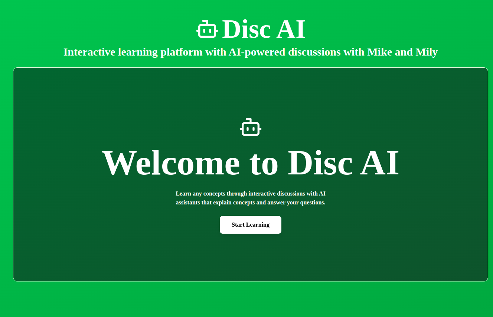
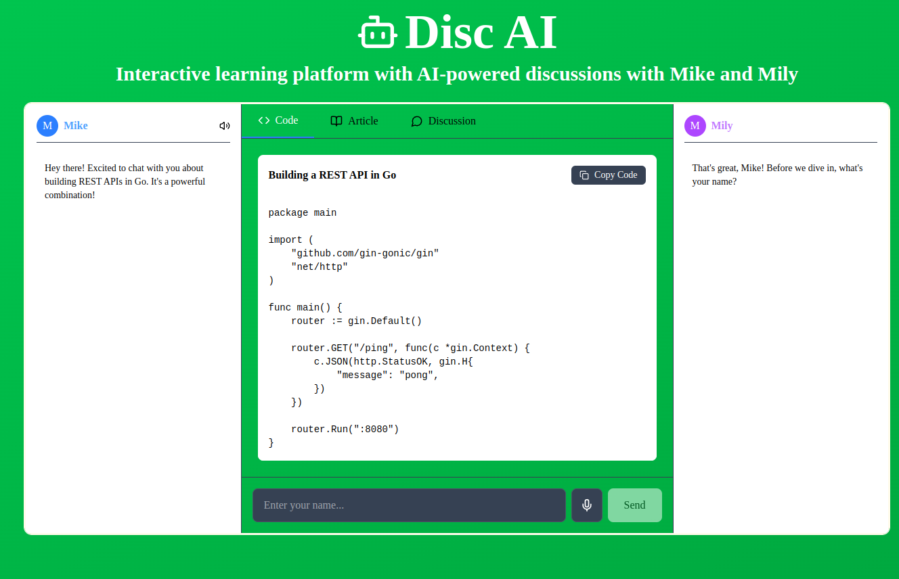
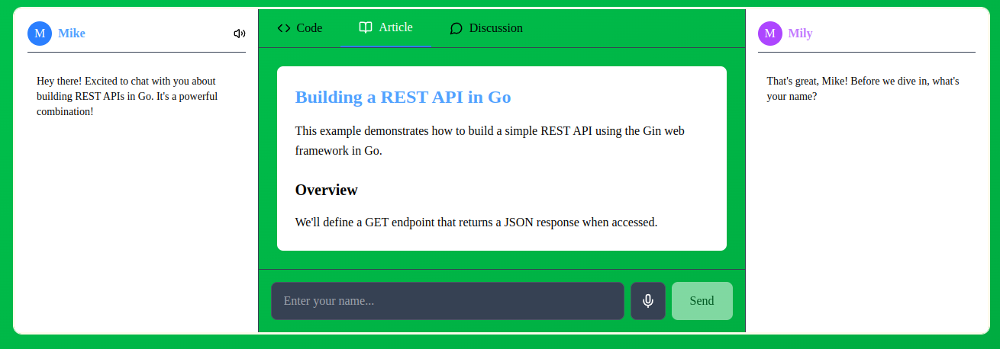
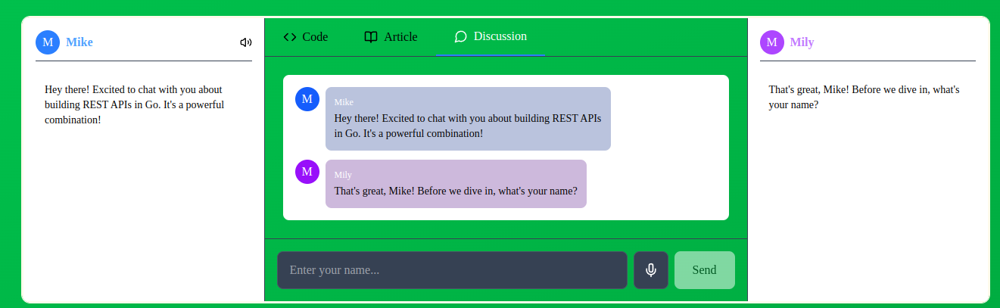
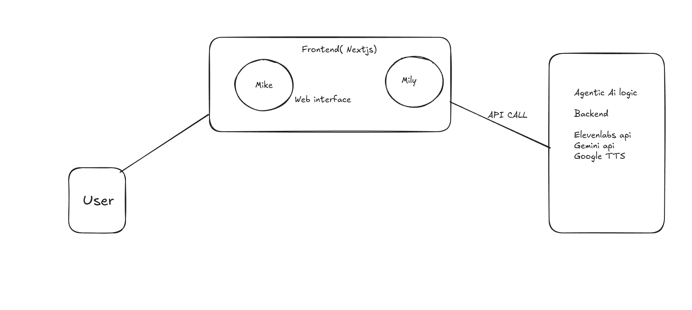

# Disc AI

**Disc AI** is an intelligent learning platform designed to make understanding new concepts fun, engaging, and effective through *discussion-based learning*.  
Built with **FastAPI** (Python), **Next.js** (JavaScript/TypeScript), and cutting-edge **Agentic AI**, Disc AI creates a conversational environment between you and two voice agents — **Mike** and **Mily** — who help you deeply understand topics or articles you want to learn.

> ✨ Because *discussion* makes learning better — even if you don't always have someone to talk to!

---

## Preview

Here’s what Disc AI looks like in action:

<p align="center">
  
  <br>
  
  
</p>

> 📸 *Screenshots from live demo of Disc AI.*

---

## Why Disc AI?

Many people learn better through conversation, but not everyone has a study partner or feels comfortable talking to others. Disc AI solves this by providing two friendly, knowledgeable AI agents who:

- **Discuss the topic** with you
- **Ask and answer questions** to deepen your understanding
- **Explain complex ideas** in simple terms
- **Make learning interactive, not passive**

It's like having your own intelligent learning buddies — always ready to chat in voice!

---

## Problem Statement

Many learners struggle with understanding new concepts through passive methods like reading articles or watching videos.  
However, active discussion greatly improves learning, but:

- Not everyone has study partners or friends available.
- Many people feel uncomfortable discussing openly.
- Traditional online learning feels one-sided and non-interactive.

**Disc AI** was created to simulate real, dynamic discussions to improve learning outcomes without needing another human on the other side.

---

## Challenges

- Designing agents that **feel natural** in discussion, not robotic.
- Ensuring **real-time voice interaction** with low latency.
- Handling **complex topic breakdowns** dynamically.
- Keeping the conversation **engaging and user-driven**.
- Building a **scalable backend** that can handle multiple sessions.

---

## How We Solve It

- **Agentic AI Models:**  
  Mike and Mily aren't just answering — they reason, debate, and build understanding through conversation.
  
- **Voice-to-Voice Interaction:**  
  Using the Web Speech API and ElevenLabs text-to-speech models for seamless voice interaction.

- **Dynamic Conversation Flow:**  
  Agents adjust explanations based on the user's responses and engagement level.

- **Scalable Architecture:**  
  FastAPI powers the backend, managing WebSocket connections for live conversation, while Next.js ensures a fast frontend experience.

---

## Architecture

The architecture of Disc AI ensures high responsiveness, modular agent design, and real-time user interaction.

<p align="center">
  
</p>

> 🛠️ *Architecture diagram illustrating the full stack and communication flow.*

---

## Key Features

- 🎙️ **Voice-Based Interaction** — Talk naturally with Mike and Mily using speech-to-text and text-to-speech technologies.
- 🤖 **Agentic AI** — Agents aren't just question-answer bots; they reason, discuss, and guide you through the material.
- 📚 **Flexible Learning** — Input any topic or article you want to learn about.
- ⚡ **Fast and Modern** — Built with FastAPI for the backend and Next.js for a blazing-fast, responsive frontend.
- 🛠️ **Open and Extensible** — Easily extend the system with new agents, new types of discussions, or custom learning flows.

---

## Tech Stack

- **Backend:**  
  - FastAPI (Python)
  - Agentic AI
- **Frontend:**  
  - Next.js (React + TypeScript)
  - TailwindCSS (for styling)
- **Other:**  
  - Web Speech API  
  - ElevenLabs (for high-quality voice interaction)
  - Google TTS package

---

## How It Works

1. Open the website no lengthy onboarding just click on start learning button and you can start learning.
---

## Setup Instructions

### 1. Clone the Repository

```bash
git clone https://github.com/your-username/disc-ai.git
cd disc-ai
```
#### frontend setup
```bash
cd frontend
npm install
npm run dev
```
#### backend setup
create virtual env first
```bash
cd backend
python3 -m venv venv
source venv/bin/activate
pip install -r requirements.txt
```
Run command 
```bash
uvicorn main:app --reload
```